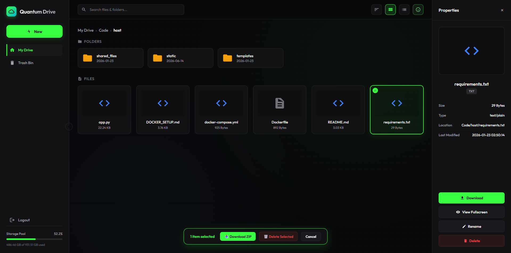
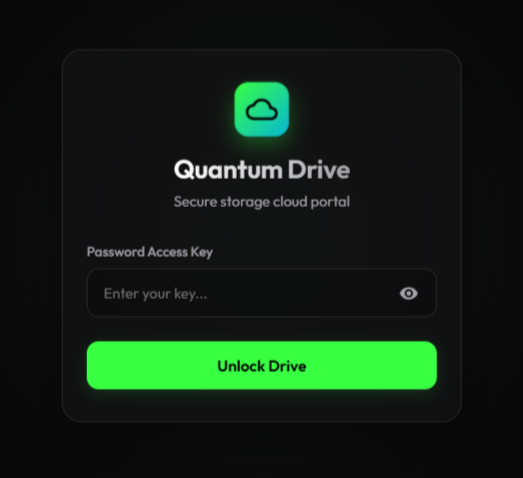

# Quantum Drive - Secure File Server

A Python-based file server with a clean, Google Drive-inspired dark interface, password protection, and rich file management features. 

[](https://opensource.org/licenses/Apache-2.0)
[](https://github.com/rajjitlai/Quantum_Drive)
[](#-linux-optimization--permissions)



---

## 🎨 Features

- 🔐 **Password-Protected Access:** Secure login gateway using secure cryptographic hashes.
- 🎨 **Modern Dark UI:** Premium Outfit typography, glassmorphic styles, and interactive micro-animations.
- 📁 **File & Directory Management:** Create directories, rename items, and edit text documents directly in the browser.
- 📥 **Batch & Folder Downloader:** Zip whole folders or selected items dynamically and stream downloads with temporary security tokens.
- 🔍 **Recursive Search:** Search folders instantly with extension type categories (Images, Documents, Code, Video, Audio).
- 👁️ **Grid & List Views:** Toggle dynamic layout grids with customized desktop-like right-click context menus.
- 📤 **Drag-and-Drop Uploads:** Easily drag and drop folders/files into the browser view.
- 📊 **Disk Storage Widget:** Displays real-time disk storage allocation metrics dynamically using host metrics.
- 🐳 **Docker Containerization:** Seamless deployment via Docker Compose with CPU/memory limits, auto-start, and container healthchecks.

---

## 🛡️ Security Features

- **Traversal Hardening:** All pathways are sanitized against directory traversal attacks (`../` sequences).
- **Hidden Resource Filtering:** Hidden files and folders (e.g. `.env`, `.git`, or custom database indexes) are automatically filtered out and blocked from API access.
- **Dynamic Secret Keys:** Generates cryptographically secure session signatures dynamically on startup if no key is configured.
- **Environment Isolation:** Credentials and sharing directories are entirely separated from the code, preventing accidental leaks.

---

## 🚀 Setup & Run

### 📦 Option 1: Native Installation

1. **Clone the Repository:**
   ```bash
   git clone https://github.com/rajjitlai/Quantum_Drive.git
   cd Quantum_Drive
   ```

2. **Install Dependencies:**
   ```bash
   pip install -r requirements.txt
   ```

3. **Configure Environment:**
   Copy the example environment file and configure your credentials:
   ```bash
   cp .env.example .env
   # Edit .env and change the ACCESS_PASSWORD immediately!
   ```

4. **Start the Server:**
   ```bash
   python app.py
   ```
   Access at `http://localhost:8765` (or your local IP address).

### 🐳 Option 2: Docker Compose (Recommended)

Start the container instantly in background detached mode:
```bash
docker-compose up -d
```
Docker Compose will automatically:
- Bind to the unique port `8765`.
- Mount the local shared folder (defined by `SHARED_FOLDER` in `.env`, defaulting to `./shared_files`) as a persistent volume.
- Restart automatically if it crashes or the server boots up.
- Enforce CPU and memory constraints.

See [DOCKER_SETUP.md](DOCKER_SETUP.md) for more details.

---

## 🌐 Cross-Platform Support & Linux Optimization

Quantum Drive is built using standard, platform-agnostic Python and HTML5 interfaces, ensuring it works seamlessly on **all operating systems** (Windows, macOS, Linux, and Docker environments).

### 🐧 Linux Optimization & Permissions
While it runs on overall systems, it is highly optimized for Linux deployments. If you share host directories outside your user home folder on Linux (e.g. `/var/shared` or custom mount points), ensure the Flask backend has proper permissions:

```bash
# Create the sharing target folder if it doesn't exist
sudo mkdir -p /path/to/shared/files

# Assign ownership to the current non-root user running the app
sudo chown -R $USER:$USER /path/to/shared/files

# Set read, write, and execute permissions on directories
chmod -R 755 /path/to/shared/files
```

### 🐳 Docker Volume Mounts
When deploying using Docker, verify that the local host path matches your desired target folder. The default bind mount maps `./shared_files` inside the project root:
- Adjust the volume maps inside `docker-compose.yml` to specify a custom host path:
  ```yaml
  volumes:
    - /path/to/shared/files:/app/shared_files
    - .:/app
  ```
- Ensure the Docker daemon has permissions to access the target path on your host machine.

---

## 📸 Portal Authentication View

Access to Quantum Drive is locked behind a portal security gateway:



---

## 📁 Configuration File (`.env`)

You can customize server properties by editing the `.env` file:

- `SHARED_FOLDER`: The directory path to share (defaults to a local directory named `shared_files` within the project folder).
- `ACCESS_PASSWORD`: Plain text login password.
- `SECRET_KEY`: Custom string used for session cookie encryption. If left blank, a random one is generated on launch.

---

## 📜 License

Licensed under the Apache License, Version 2.0 (the "License"); you may not use this project except in compliance with the License. You may obtain a copy of the License in the [LICENSE](LICENSE) file or at:

[http://www.apache.org/licenses/LICENSE-2.0](http://www.apache.org/licenses/LICENSE-2.0)
